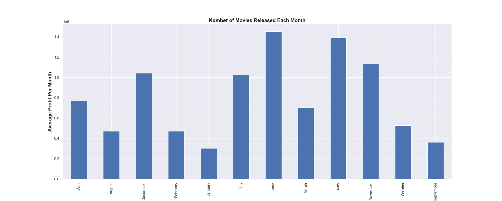
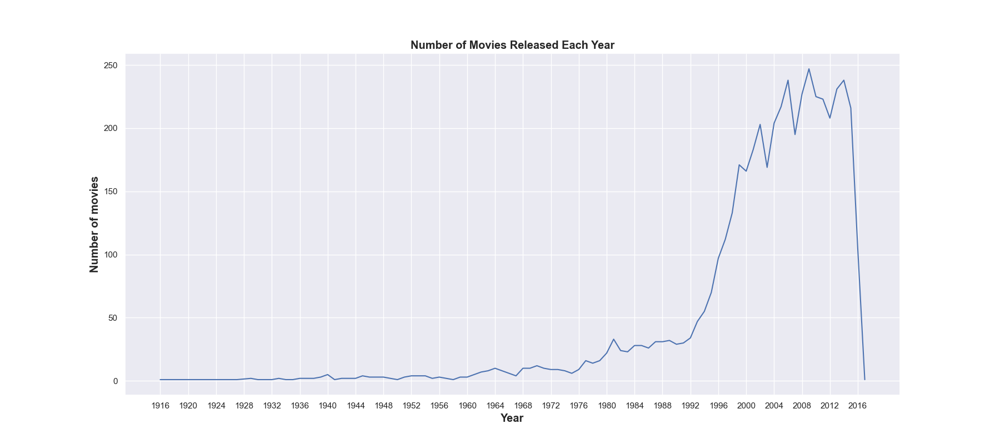

# Investigate a Dataset

In this project, My task was to choose a data from Udacity curated datasets, analyze the data, and then communicate and share my findings about the data.


# TMDb movie data
I choose to analyze TMDb dataset which contains information
about 5000 movies collected from
The Movie Database (TMDb),
including user ratings and revenue found in [here](https://www.kaggle.com/datasets/tmdb/tmdb-movie-metadata).
## Installation

Install required libraries

```python
* pandas
* NumPy
* Matplotlib
* csv
```
    

# Skills Aquired
- Learned all the steps involved in a typical data analysis process
- learned how to investigate problems in a dataset and wrangle the data into a format you can use
- how to communicating the results of my analysis
- learned how to use Matplotlib to produce plots showing my findings

# Viz Snapchat

