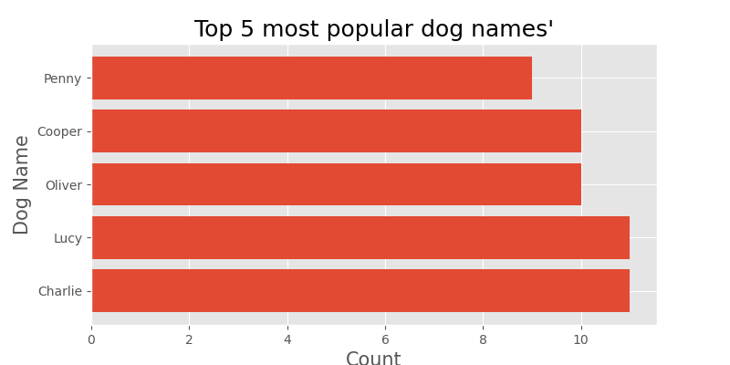

{
 "cells": [
  {
   "cell_type": "markdown",
   "id": "d9a5577e",
   "metadata": {},
   "source": [
    "# Wrangle and Analyze\n",
    "\n",
    "The primary objective of this project was to learn the data wrangling process of gathering, assessing, and cleaning data and learn how to use Python to wrangle data programmatically and prepare it for analysis.\n",
    "\n",
    "# WeRateDogs\n",
    "In this projec I worked with a tweet archive data called WeRateDogs. WeRateDogs is a Twitter account that rates people’s dogs with a humorous comment about the dog. These ratings almost always have a denominator of 10\n",
    "including user ratings and revenue. I collected the data from a variety of sources and in a variety of formats including provided csv and Json ontained from Tweeter API and I assessed its quality,tidiness, then clean it.\n",
    "\n",
    "## Required libraries\n",
    "\n",
    "```python\n",
    "* pandas\n",
    "* NumPy\n",
    "* Matplotlib\n",
    "* Tweepy\n",
    "* Seaborn\n",
    "* csv\n",
    "* Json\n",
    "```\n",
    "    \n",
    "\n",
    "# Skills Aquired\n",
    "- I learned how gather data from different sources i.e. flat files, Api's or simply downloadin from the web using python. I also learned how to:\n",
    "\n",
    "- Assess data\n",
    "\n",
    "- Clean data\n",
    "\n",
    "- Store, Analyze, and visualize data\n",
    "\n",
    "- and Lastly documents and Report my findings\n",
    "\n"
   ]
  },
  {
   "cell_type": "code",
   "execution_count": null,
   "id": "1f030529",
   "metadata": {},
   "outputs": [],
   "source": []
  }
 ],
 "metadata": {
  "kernelspec": {
   "display_name": "Python 3 (ipykernel)",
   "language": "python",
   "name": "python3"
  },
  "language_info": {
   "codemirror_mode": {
    "name": "ipython",
    "version": 3
   },
   "file_extension": ".py",
   "mimetype": "text/x-python",
   "name": "python",
   "nbconvert_exporter": "python",
   "pygments_lexer": "ipython3",
   "version": "3.9.13"
  }
 },
 "nbformat": 4,
 "nbformat_minor": 5
}
